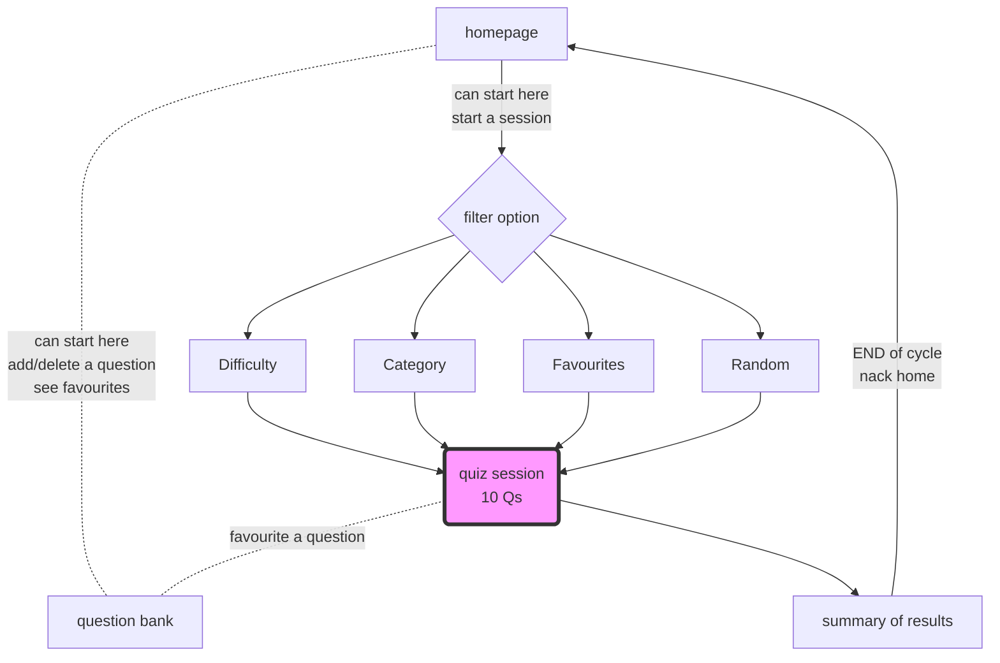

# P1DAAF
Hello and Welcome to out Quiz App!!!


This is the beginning of the backend of our quiz app. 

it currently has functionality to 
- see a random question
- see a filtered question by category or difficulty or if favourtited. 

- delete a question by a an id

- edit a question by id


**how to test**

1. clone the repo
2. run ```npm install```
3. run ```npm run dev```

you will need an API client, such as BRUNO or POSTMAN

1. how to test POST:

use bruno or postman (or any API client)
make a POST request with this URL: http://localhost:3001/create-question
here is a test JSON to add to the body of the request:
{ "id": "704", "category": "History", "difficulty": "easy", "question": "When was Princess Diana Born?", "options": ["01/07/1998", "07/07/1998", "02/02/1961", "09/09/1990"], "answer": "07/07/1998", "favourited": true, "timestamp": "10/10/10" } 

you should get a success message. 


2. how to test Delete
use bruno or postman (or any API client)
make a DELETE request with this URL: http://localhost:3001/delete-post/<id number>

you should get a success message --> also you can check the data.json file, to see if the obj with that id is GONEEE. 


3. how to test Favourtire/ Unfavourite
   check an object that has a field of favourite: false
use bruno or postman (or any API client)
make a PUT request with this URL: http://localhost:3001/togglefav/<id number>

you should get a success message --> also you can check the data.json file, to see if the obj with that id in the favourite field has updated with the opposite ( favourite:true )

this works vice versa. 


4. Edit
use bruno or postman (or any API client)
make a POST request with this URL: http://localhost:3001/edit-question/

here is a test JSON to add to the body of the request:
{ "id": "12", "category": "History", "difficulty": "easy", "question": "When was Princess Diana Born?", "options": ["01/07/1998", "07/07/1998", "02/02/1961", "09/09/1990"], "answer": "07/07/1998", "favourited": true, "timestamp": "10/10/10" } 

5. you can test random 
you can do on the browser
http://localhost:3001/random/<a number>

<a number> is the number of questions you want


## Here is a flow of the user journey:



The user is able to filter questions by difficult, topic, favourites or just see random questions. 


