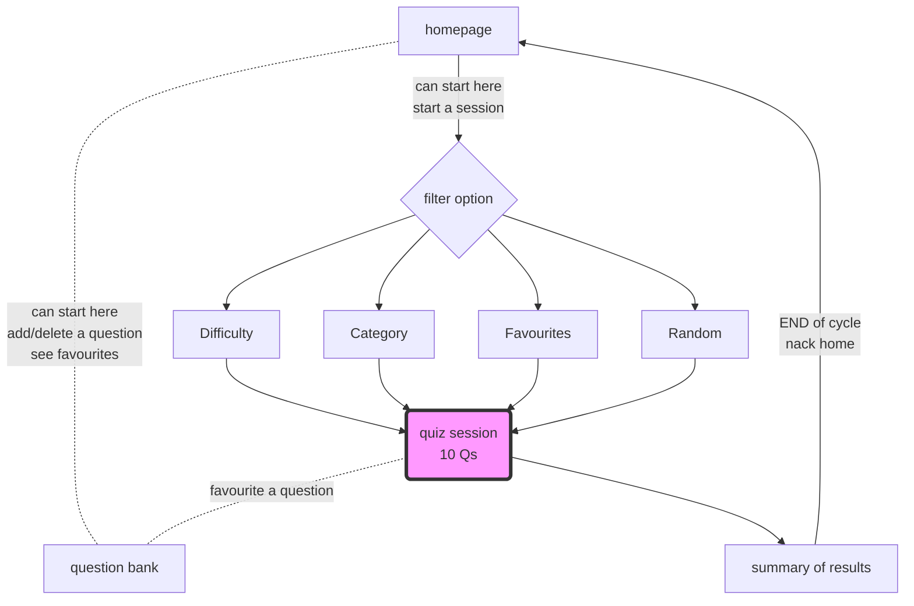

# P1DAAF


Hello and Welcome to our Quiz App! Built with typescript, node deployed on AWS. Tested with POSTMAN

A RESTful API built with TypeScript and Node.js for managing a bank of questions. This API allows users to check, add, edit, and delete questions. It is tested using Postman.

## Table of Contents

- [Functionality](#functionality)
- [Installation](#installation)
- [Usage](#usage)
- [API Endpoints](#api-endpoints)
- [Testing](#testing)
- [Contributing](#contributing)
- [License](#license)

## Functionality

- See all questions
- See a random question
- Create a question
- Delete a question
- Favourite and unfavourite a question
- Edit a question
- See a filtered question by category, difficulty, ID or if favourited.

## Installation

1.  **Clone the repository:**

    ```sh
    git clone https://github.com/fac29/P1DAAF-Backend.git
    cd P1DAAF-Backend
    ```

2.  **Install dependencies:**

    ```sh
    npm install
    ```

3.  **Set up environment variables:**

    Create a `.env` file in the root directory and add your configuration settings.

    ```env
    PORT=3000
    ```

4.  **Run the application:**

    ```sh
    npm start
    ```

## Usage

### Running the Server

To start the server, use the following command:

```sh
npm run dev
```

The server will run on the port specified in the `.env` file. If no port is specified, it will default to `3000`.

### API Endpoints

#### Get all questions

```http
GET /api/questions
```

#### Get a single question by ID

```http
GET /api/questions/:id
```

#### Add a new question

```http
POST /api/questions
```

**Request Body:**

```json
{
  "id": 704,
  "category": "History",
  "difficulty": "easy",
  "question": "When was Princess Diana Born?",
  "options": ["01/07/1998", "07/07/1998", "02/02/1961", "09/09/1990"],
  "answer": "07/07/1998",
  "favourited": true,
  "timestamp": "2023-01-01T00:00:00Z"
}
```

#### Edit a question

Use a question that exists in the database already but use the format as below.

```http
PUT /api/questions/:id
```

**Request Body:**

```json
{
  "id": 704,
  "category": "History",
  "difficulty": "easy",
  "question": "When was Princess Diana Born?",
  "options": ["01/07/1998", "07/07/1998", "02/02/1961", "09/09/1990"],
  "answer": "07/07/1998",
  "favourited": true,
  "timestamp": "2023-01-01T00:00:00Z"
}
```

#### Delete a question

```http
DELETE /api/questions/:id
```

## Testing

To test the API endpoints, you can use [Postman](https://www.postman.com/).

1. Import the Postman collection provided in the repository.
2. Run the requests to test various endpoints.

## Here is a flow of the user journey:



The user is able to filter questions by difficult, topic, favourites or just see random questions.

## Contributing

Contributions are welcome! Please follow these steps to contribute:

1. Fork the repository.
2. Create a new branch (`git checkout -b feature-branch`).
3. Make your changes.
4. Commit your changes (`git commit -m 'Add some feature'`).
5. Push to the branch (`git push origin feature-branch`).
6. Open a pull request.

## License

This project is licensed under the MIT License. See the [LICENSE](LICENSE) file for details.
