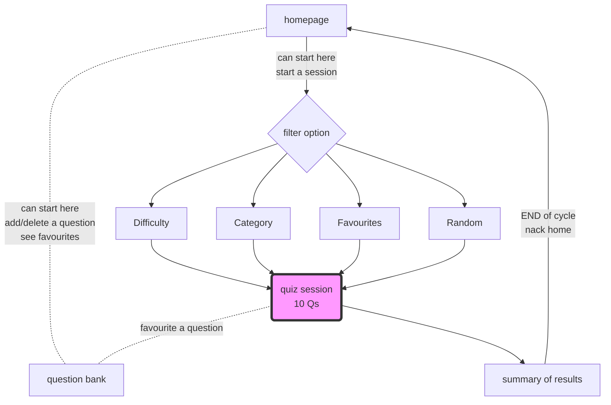

# P1DAAF
Hello and Welcome to out Quiz App

## Here is a flow of the user journey:

```mermaid

flowchart TD
    A[homepage] -.-|
    can start here
    add/delete a question
    see favourites| B[question bank]
    A --> |can start here
    start a session|C{filter option}
    C --> D[Difficulty]
    C --> E[Category]
    C --> F[Favourites]
    C --> G[Random]
    D --> H(quiz session
    60 secs)
    style H fill:#f9f,stroke:#333,stroke-width:4px
    H-.-|favourite a question| B
    E --> H
    F --> H
    G --> H(quiz session
    10 Qs)


    H --> I[summary of results]
    I -->|END of cycle
    nack home| A 

```

The user is able to filter questions by difficult, topic, favourites or just see random questions. 

