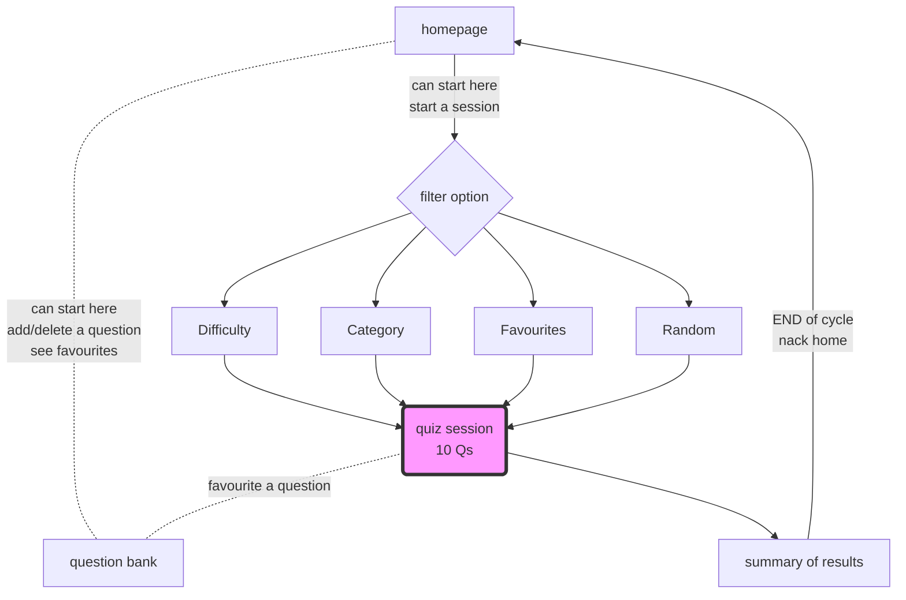

# P1DAAF


Hello and Welcome to our Quiz App! Built with typescript, node deployed on AWS. Tested with POSTMAN

## Functionality includes:

- See all questions
- See a random question
- Create a question
- Delete a question
- How to favourite and unfavourite
- Edit a question
- See a filtered question by category, difficulty, ID or if favourite.

**How to test**

1. clone the repo
2. run `npm install`
3. run `npm run dev`

You will need an API client, such as BRUNO or POSTMAN.

### 1. How to get all questions:

Send a POST request to the URL of `http://localhost:3000/`

### 2. How to See a Random Question

You can test this on the browser
`http://localhost:3000/random/quantity-of-questions-here`

### 3. How to test Creating a Question (POST request):

Use bruno or postman (or any API client).
Make a POST request with this URL: `http://localhost:3000/create-question`
Here is a test JSON to add to the body of the request:

```json
{
  "id": "704",
  "category": "History",
  "difficulty": "easy",
  "question": "When was Princess Diana Born?",
  "options": ["01/07/1998", "07/07/1998", "02/02/1961", "09/09/1990"],
  "answer": "07/07/1998",
  "favourited": true,
  "timestamp": "10/10/10"
}
```

You should get a success message.

### 4. How to test Delete:

use bruno or postman (or any API client)
make a DELETE request with this URL: `http://localhost:3000/delete-post/question-id-number-here`

you should get a success message --> also you can check the data.json file, to see if the obj with that id is GONEEE.

### 5. How to test Favourtire/ Unfavourite

Check an object that has a field of favourite: false
Use bruno or postman (or any API client)
Make a PUT request with this URL: `http://localhost:3000/togglefav/question-id-number-here`

You should get a success message --> also you can check the data.json file, to see if the obj with that id in the favourite field has updated with the opposite ( favourite:true )

this works vice versa.

### 6. How to test edit (POST request)

use bruno or postman (or any API client)
make a POST request with this URL: `http://localhost:3000/edit-question/`

here is a test JSON to add to the body of the request:

```json
{
  "id": "12",
  "category": "History",
  "difficulty": "easy",
  "question": "When was Princess Diana Born?",
  "options": ["01/07/1998", "07/07/1998", "02/02/1961", "09/09/1990"],
  "answer": "07/07/1998",
  "favourited": true,
  "timestamp": "10/10/10"
}
```

### 7. Filtered questions (GET request)

To filter by category and difficulty:

`http://localhost:3000/filter/:category/:difficulty`

To get a question by ID:

`http://localhost:3000/get-question-by-id/:id`

## Here is a flow of the user journey:



The user is able to filter questions by difficult, topic, favourites or just see random questions.
