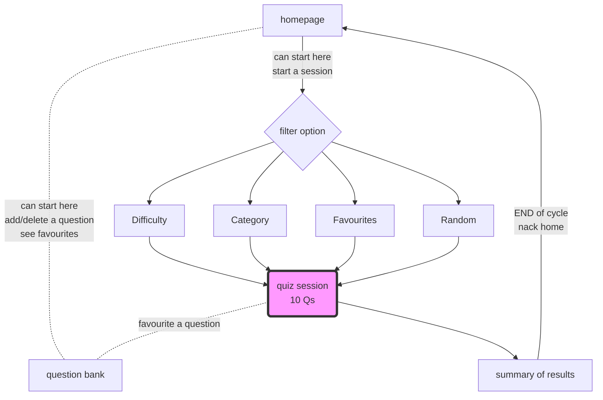

# P1DAAF
Hello and Welcome to our Quiz App!!!

It currently has functionality to 
- see a random question
- see a filtered question by category or difficulty or if favourtited. 
- delete a question by a an id
- edit a question by id

**How to test**

1. clone the repo
2. run ```npm install```
3. run ```npm run dev```

You will need an API client, such as BRUNO or POSTMAN

1. How to test POST:

    Use bruno or postman (or any API client).
    Make a POST request with this URL: http://localhost:3001/create-question
    Here is a test JSON to add to the body of the request:

    ```json
    { "id": "704", "category": "History", "difficulty": "easy", "question": "When was Princess Diana Born?", "options": ["01/07/1998", "07/07/1998", "02/02/1961", "09/09/1990"], "answer": "07/07/1998", "favourited": true, "timestamp": "10/10/10" } 
    ```
    You should get a success message. 


2. How to test Delete:
    use bruno or postman (or any API client)
    make a DELETE request with this URL: http://localhost:3001/delete-post/question-id-number-here

    you should get a success message --> also you can check the data.json file, to see if the obj with that id is GONEEE. 


3. How to test Favourtire/ Unfavourite
    Check an object that has a field of favourite: false
    Use bruno or postman (or any API client)
    Make a PUT request with this URL: http://localhost:3001/togglefav/question-id-number-here

    You should get a success message --> also you can check the data.json file, to see if the obj with that id in the favourite field has updated with the opposite ( favourite:true )

    this works vice versa. 


4. How to test edit
    use bruno or postman (or any API client)
    make a POST request with this URL: http://localhost:3001/edit-question/

    here is a test JSON to add to the body of the request:
    ```json
    { "id": "12", "category": "History", "difficulty": "easy", "question": "When was Princess Diana Born?", "options": ["01/07/1998", "07/07/1998", "02/02/1961", "09/09/1990"], "answer": "07/07/1998", "favourited": true, "timestamp": "10/10/10" } 
    ```

5. How to test random 
    You can test this on the browser
    http://localhost:3001/random/quantity-of-questions-here


## Here is a flow of the user journey:



The user is able to filter questions by difficult, topic, favourites or just see random questions. 


Generate Private keys for HTTPS:
On the project root execute:


Create folders "keys/certs" on the root
mkdir -p keys/certs

openssl genpkey -algorithm RSA -out keys/selfsigned.key
openssl req -new -key keys/selfsigned.key -out keys/selfsigned.csr
openssl x509 -req -in keys/selfsigned.csr -signkey keys/selfsigned.key -out keys/certs/selfsigned.crt -days 365


Common Name:
    on the ec2 instance is the IP address: 18.175.120.83
    for local testing: localhost

For easy upadate the code on the EC2 instance without losing the keys folder add it to the local exclude:
    nano .git/info/exclude

    Add there:
        keys/


